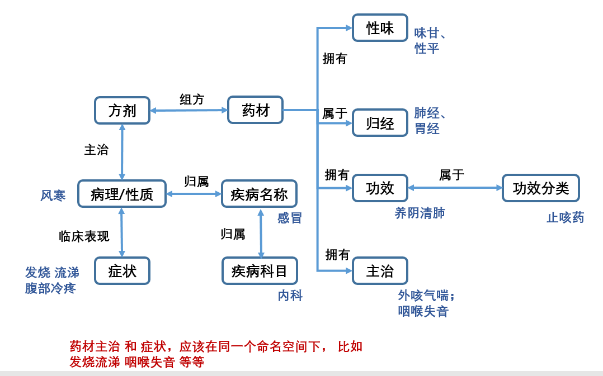

# 知识图谱网络数据

### 概述

该目录下保存了知识图谱的网络。网络的设计拓扑图如下图所示：

部分文件说明如下：

* `graph` - 融合后的“成品”知识网络；融合了两部分的子图，并添加了[部分内容](../database/方剂#24855/data.zip)
* `subgraph_wrt_medicine` - 药材侧的子图
* `subgraph_wrt_recipe` - 方剂侧的子图
* `rdf_namespace.py` - 关于部分RDF前缀（命名空间）与关系的定义
* `std_keywords` - 各类节点的id与部分关键词的对应表

### 结构说明

网络中涉及五类节点（本体）、六类边（关系）。

五类节点：

* 方剂（recipes）
* 药材（(medicine) materials)
* 病症（(diseases &) symptoms）
* 功效（effects） - 药物与方剂的功效；因为俩类的功效用词重合度较高，故合并在一起
* 病机与性质（pathogeneses (& characteristics)）

六类边：

* `comprises` - 包含：<方剂, **包含**, 药材>
* `majorIn` - 主治：<方剂/药材, **主治**, 病症>
* `hasEffect` - 具有（功效）：<方剂/药材, **具有**, 功效>
* `treatmentPlan` - 治疗方案：<病症, **方案**, 功效>
* `originatesFrom` - 发端：<病症, **发端**, 病机>
* `applysOn` - 有效于：<功效, **有效于**, 病机>
